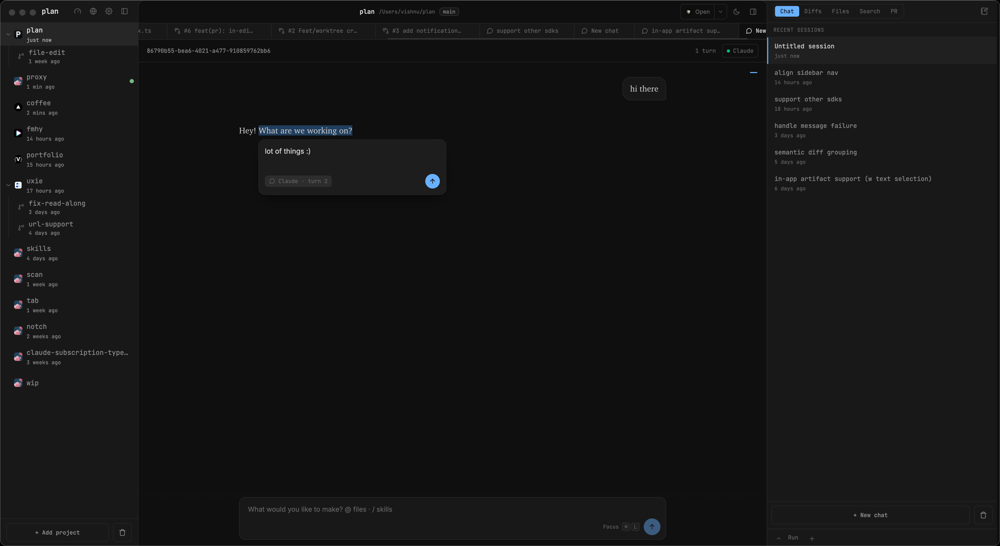

# plan



Review & iterate on code and messages w.o copy pasting your life away :)

Two pieces live here:

## Desktop app (`apps/desktop`)

A cockpit for driving Claude Code. It reads your local Claude projects and chat sessions and gives you a real UI on top of them:

- **Chats** — Read through conversation transcripts, select any text, and leave comments for deeper review.
- **Diffs** — Browse both staged and unstaged changes, stage/unstage or discard changes down to the hunk level, then commit and push directly from the UI.
- **Files** — Instantly open any file in the project using a `⌘P` fuzzy finder and explore code with an integrated viewer.
- **Search** — Search across your entire project for text.

Anything you select — in a chat, a diff, a file, or a plan — can be turned into a comment, and those comments get sent straight into the live Claude session running in the embedded terminal (`⌘J`). It pastes into the actual `claude` CLI.

### Why a layer on top of the terminal CLI?

The app drives the **terminal version** of Claude (the `claude` CLI) rather than talking to an SDK or API. That's a deliberate choice:

- **It can't be taken away from under you.** Providers can restrict or revoke programmatic SDK/API access with little notice — Claude itself nearly did, announcing a change and reversing it only a few days before it was scheduled to land. Building on the CLI that ships with your normal subscription means the app keeps working regardless of how the API terms shift.
- **It's harness-agnostic.** Because we're just driving a terminal program, the same UI can sit on top of *any* terminal-based coding agent — Claude Code today, and others like [Pi](https://github.com/earendil-works/pi), [OpenCode](https://github.com/anomalyco/opencode), and whatever comes next tomorrow. Swap the harness, keep the cockpit.
- **Everything is saved, everywhere.** One UI for chats, diffs, files, search, and comments across all those harnesses — your review workflow and history live in one place no matter which agent you're driving.

In short: this is the way to go. The terminal is the most stable, most portable surface to build on.

## Web app (`apps/web`)

A zero-install diff-and-comment tool in the browser. Paste an original and a changed version, get an interactive side-by-side diff, and:

- Select text to drop inline comments.
- Copy a tidy, LLM-ready message of all your feedback.
- Share a link with both versions baked into the URL, or copy a plain unified diff.

## Validating a change

One command checks every package in the workspace:

```
pnpm run validate
```

It runs, in order and stopping at the first failure:

| Step                    | Covers                               |
| ----------------------- | ------------------------------------ |
| `pnpm run typecheck`    | `shared`, `apps/web`, `apps/desktop` |
| `pnpm test`             | `apps/desktop` (vitest)              |
| `pnpm run lint`         | `apps/web` (eslint)                  |
| `pnpm run format:check` | `shared`, `apps/web`, `apps/desktop` |

Run any step on its own while iterating. For a single test file, `pnpm --filter @plan/desktop exec vitest run test/<name>.test.ts`. `pnpm run format` rewrites files instead of just checking them.

The release workflow runs `validate` as its first job and refuses to build or publish if it fails.

---

Shared diff/comment logic lives in `shared/`. The whole thing is built almost entirely with Claude Code (this README included, this time :p).
